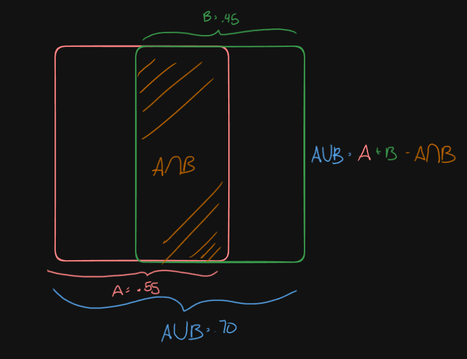
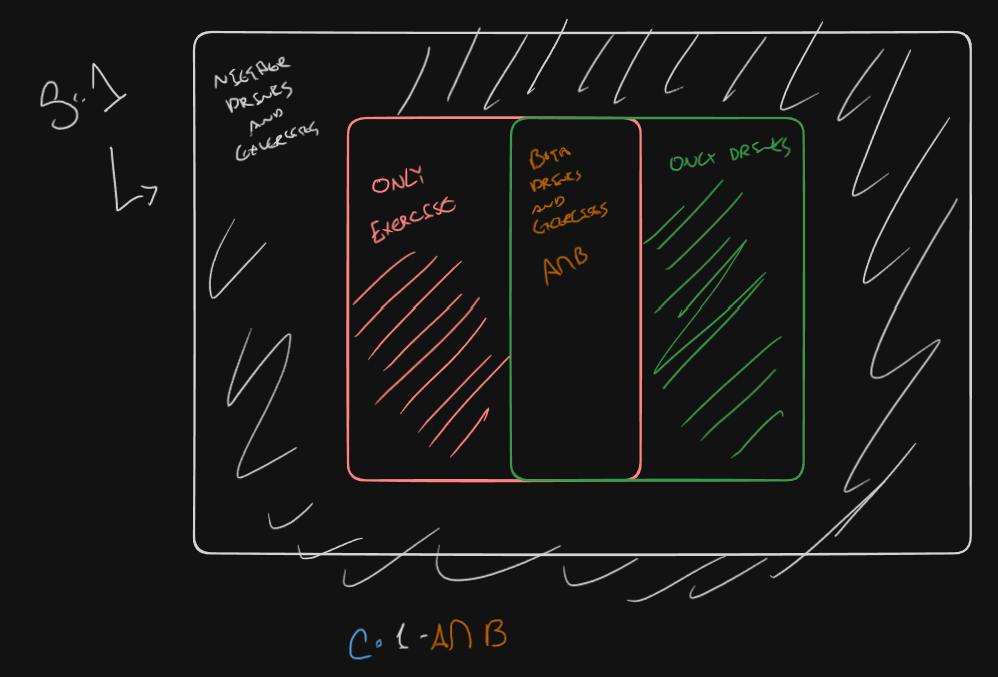

"Suppose 55% of people exercise and 45% drink alcohol. Also, 70% do at least one of these.

What is the probability that a randomly selected person:"

# Question 1
Exercise and drinks alcohol?

We set $A$ to be the event people exercise and $B$ to be those who drink alcohol.
$$
P(A) = .55\\
P(B) = .45\\
A \bigcup B = .70
$$

We can say:
$$
A \bigcup B = A + B - A\bigcap B\\
.70 = .55 + .45 -  A\bigcap B \\
 A\bigcap B = .30
$$

# Question 2:
Does not do at least one of the two activities? (Only drink or only exercise or none : $C$

$$
C = 1 - A \bigcap B = 1 - .30 = .70
$$
