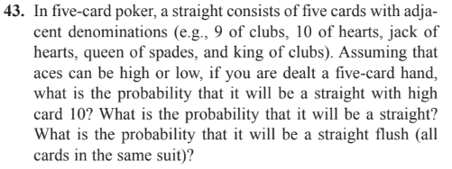
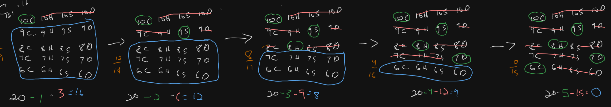
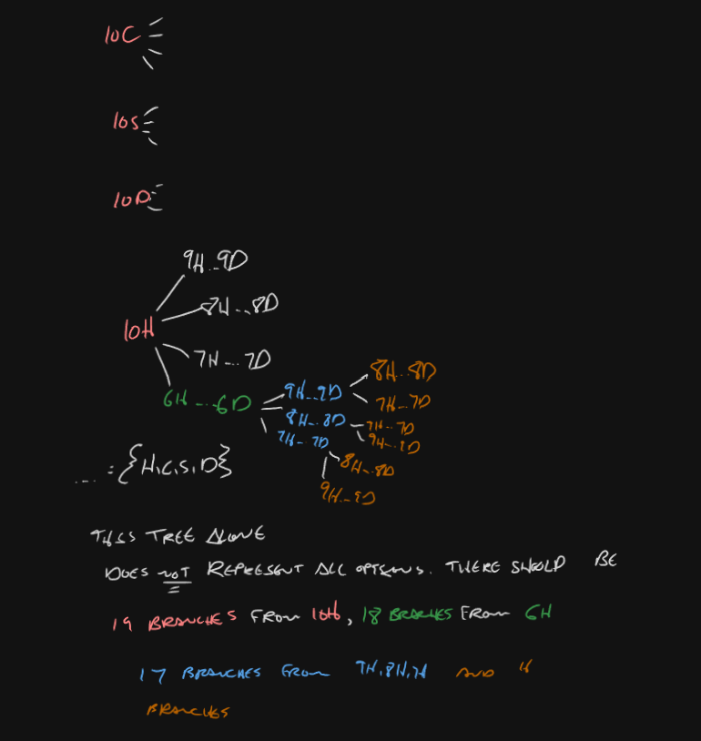
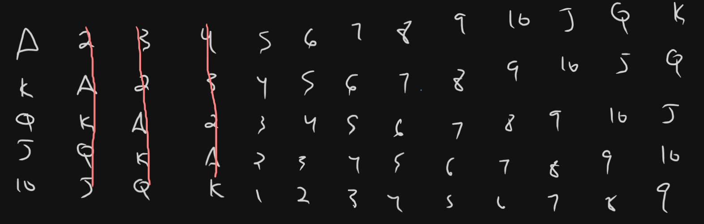

# Question

**Source**: [Devore pg 72 Q 43](https://drive.google.com/file/d/11Ggp-RNoknu7ARu95s54hvOsQMv0AgR-/view)

# Part 1

We want to know the chance of getting a straight with a high card of 10. The sample space $\mathcal{S}$ of being dealt a **unique** $5$ card set from a $52$ set is massive. We say unique as it does matter what the order in which you are dealt the cards, as long as you have a $6,7,8,9,10$ cards in your deck then you have a straight.

 The number of cards possible to form a high card $10$ straight, $n_c$, is the number of cards drawn in your hand $k = 5$ multiplied by the possible suits $\{H, C, D, S \} = 4$

$$
n_c = k \times 4 = 20
$$

Now we can do a simple combinaitons to find the number of all possible ways you could draw from the $20$ card set:
$$
\begin{align*}
n_s &= C_{n_c, k} = \binom{n_c}{k} = \frac{n_c!}{k! ( n_c - k)!} = \frac{20!}{5!15!} = 15504
\end{align*}
$$
The issue with this number is that it includes sets in which you can draw a $\{10H,10C, 10D, 10S, 9S\}, ...$. For each card type, $\{10,9,8,7,6\}$ we want to find the number of times that card type shows up only once in your hand. We can think of pulling a card from the the possible card deck as an experiment. We can use the Binomial Probability Density Function (BPDF) where the number of trials $n=1$ and the number of desired outcomes is $x=1$

$$
\begin{align*}
b(1;1,p) &= C_{1,1}p^1(1-p)^{1-1} \\\\
&= \frac{1!}{1!(1-1)!}p = p
\end{align*}
$$ 

The probability of pulling a selected card will change based on the index in which it is pulled. If I pull a $10C$, I can not pull $\{10H, 10S, 10D\}$ anymore. The number of allowed cards, $n_a$ decreases by $4$ for every turn, $n_t$.  We can model this as $n_a = n_c - 4n_t$. For every turn the deck, $n_d$ also decreases by $1$ since we are taking a card out of the deck $n_d = n_c - n_t$

$$
p_n= \frac{n_a}{n_d} = \frac{n_c - 4n_t}{n_c - n_t} = \frac{20 - 4n_t}{20 - n_t}
$$
Therefore the probabiltiy of selecting a card in subsequent order to form a straight high card $10$ is 
$$
\begin{align*}
p_0 &= \frac{20-4(0)}{20 - 0} = \frac{20}{20} = 1\\\\
p_1 &= \frac{20 - 4(1)}{20 - 1} = \frac{16}{19} \\\\
p_2 &= \frac{20 - 4(2)}{20 -2} = \frac{12}{18} = \frac{2}{3}\\\\
p_3 &= \frac{20 - 4(3)}{20 -3} = \frac{8}{17}\\\\
p_4 &= \frac{20-4(4)}{20-4} = \frac{4}{16} = \frac{1}{4}\\\\
1 &\times \frac{16}{19} \times \frac{2}{3} \times \frac{8}{17} \times \frac{1}{4} \approx 6.6047\%
\end{align*}
$$

Multiply this by $n_s$:
$$
15504 \times .066047 = 1024
$$

This is the number of different ways of getting a straight/ straight flush with a high card $10$ (or any card). This makes sense cause for a $5$ card draw with $4$ possible suits is simply $4^5 = 1024$.  For a straight and not a straight flush we subtract by $4$ for the cases:
$$
\{6H, 7H,8H,9H,10H\}\\
\{6D, 7D,8D,9D,10D\}\\
\{6C, 7C,8C,9C,10C\}\\
\{6S, 7S,8S,9S,10S\}\\
1024 - 4 = 1020
$$

Now all possible outcomes of pulling a $5$ card hand from a $52$ card deck
$$
C_{52,5} = \frac{52!}{5!(52-5)!} = 2598960
$$
so now we say:
$$
P_{10} = \frac{1020}{2598960} = .0392\%
$$

# Part 2
There are only $10$ possible ways to get a straight:

For each possible way, we already solved the number of combinations to get a straight $1020$. 

$$
\frac{10 \times 1020}{2598960} = .392\%
$$

# Part 3
For a straight flush, for every possible straight, only $4$ constitutes a straight flush:
$$
\frac{10 \times 4}{2598960} = .001539\%
$$

