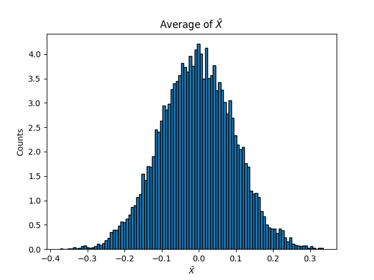
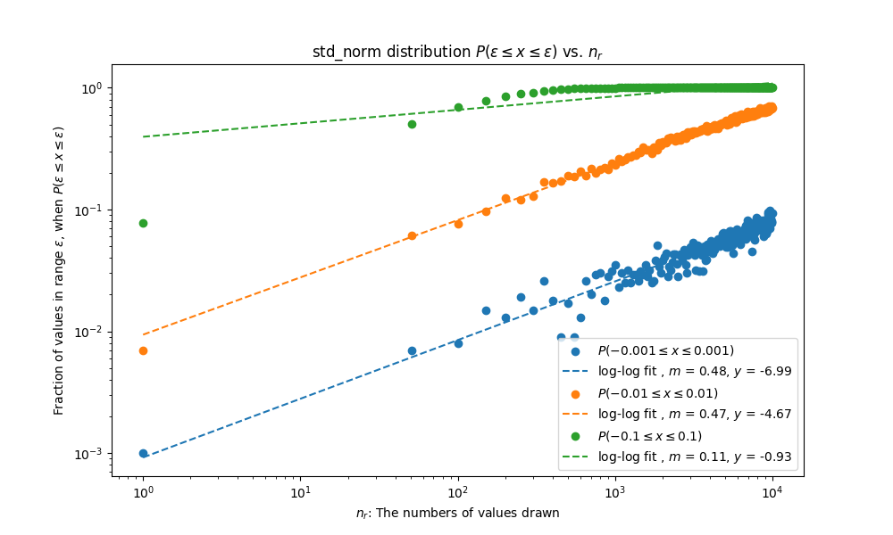

# 3.2 Law of Large Numbers

## 3.2.1

The probability distribution function of drawing 100 values from a standard normal distribution 10,000 times:

## 3.2.2

### Part 1:

For $n_r = 100$ the fraction of $10000 \bar{X}$ between $[-0.01,0.01]$ is $\approx 0.063$

### Part 2:

The fraction within $[-0.01,0.01]$ for a standard normal distribution increases logarithmically as we  logarithmically increase the number of trials. The change in the number of values drawn is proportional to the fraction within a range so we can fit a $log-log$ plot onto this relationship. as we increase the window the relatinship simply shifts up until we reach $y=1$, where it flattens out.

# Part 3:

For this i continuously calculate the fraction within until **fraction_within** is above $.99$.

| $\epsilon$| fraction_in_range | distribution |
|-------|-----|-------|
| 0.2615 | 0.991 | std_norm |
| 0.1613 | 0.991 | uni |
| 0.2615 | 0.991 | bin |
| 0.2815 | 0.996 | poi |
| 0.4018 | 0.992 | chi2 |
| 0.5020 | 0.991 | gauss |
| 0.3817 | 0.992 | geo |

# Part 4:

When we increase the range of $\epsilon$, the relationship between number of samples drawn $n_r$ and fraction within $\epsilon$ maintains the same linear relationship, except that the starting $y$ axis is higher as more values are incorporated within $\epsilon$. with a higher range, once the fraction $\rightarrow$ 1, it flattens as more values can not be included into the $\epsilon$

# Part 5:

For the plots that do actually work, the slope $m$ and $y$ intercept of the fitting lines remains relatively constant between distribution types. This could be a consequence of the **Central Limit Theory** where "The sample mean of a large random sample of random variables with mean $\mu$ and finite variance $\sigma^2$ has approximately the normal distribution with mean $\mu$ and variance $\sigma^2/n$." 

This makes sense as there is variance in the fraction within $\epsilon$ whe $n_r$ is a low.  as we increase $n_r$, more data of the fraction is generated scaling with $n_r$. because more points are defined with large $n_r$ the fitting plots are more "biased" towards the high $n_r$ rather than low. For high $n_r$ all scatter plots of the same $\epsilon$ range across distributions functions converge at roughly the same area. This is from the **Law of Large Numbers**: "Since $\bar{X}_n$ converges to $\mu$ in probability, it follows that there is high probability that $\bar{X}_n$ will be close to $\mu$ if the sample size $n$ is large."
